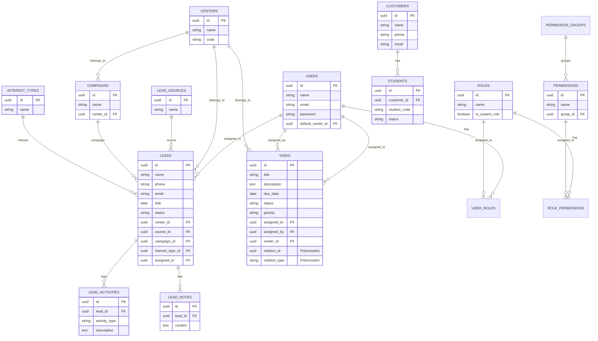

# Entity Relationship Diagram (ERD)

This document describes the database schema of the Edu CRM system.

## Database Schema

## Key Relationships

### Core Authentication & RBAC
- **USERS** are assigned **ROLES** through the `user_roles` table.
- **ROLES** carry multiple **PERMISSIONS** via the `role_permissions` table.
- **PERMISSIONS** are organized into **PERMISSION_GROUPS** for easier management.

### CRM & Lead Management
- **LEADS** are the core entry point for potential customers.
- Each **LEAD** belongs to a **CENTER** and can be assigned to a **USER** (Staff/Manager).
- **LEADS** track their origin through **LEAD_SOURCES** and **CAMPAIGNS**.
- **LEAD_ACTIVITIES** and **LEAD_NOTES** provide a history of interactions with the lead.

### Education
- When a **LEAD** is converted, it becomes a **CUSTOMER** (the payer/parent).
- A **CUSTOMER** can have one or more **STUDENTS** (the learners).

### Task Management
- **TASKS** can be assigned to **USERS** and are scoped to a **CENTER**.
- **TASKS** use a polymorphic relationship (`relation_id`, `relation_type`) to link to various entities like **LEADS**, **CUSTOMERS**, or **STUDENTS**.
